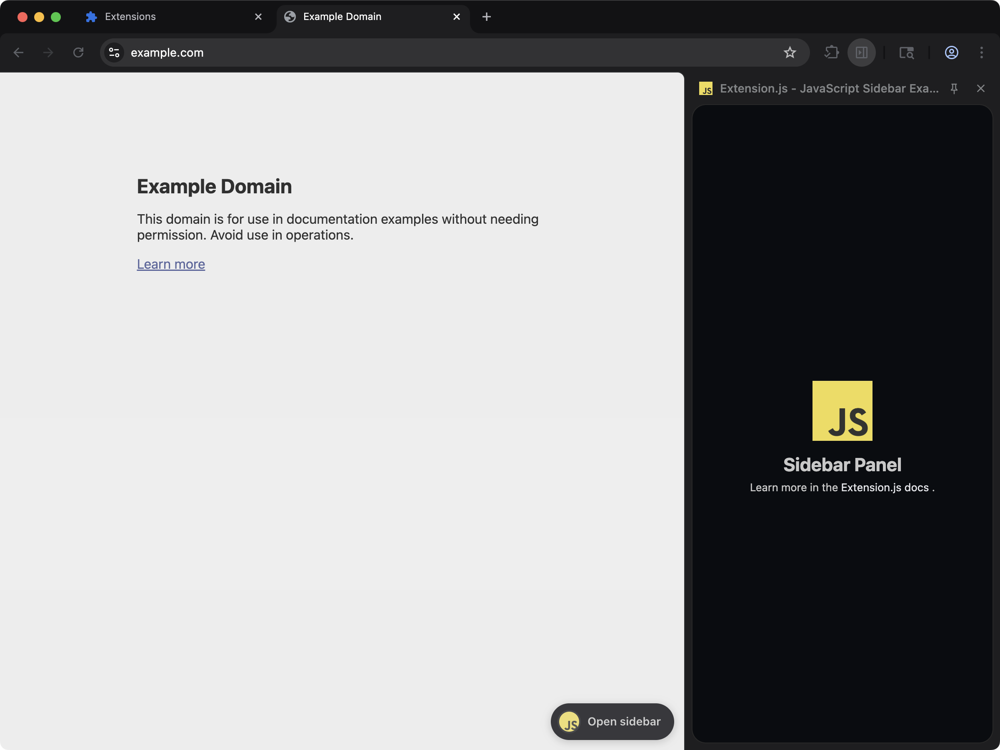

<a href="https://extension.js.org" target="_blank" rel="noopener noreferrer"></a>

# polymarket-bot

> JavaScript-based extension with a sidebar panel. Adds a sidebar with a simple page.



## Commands

### dev

Run the extension in development mode. Target a browser with `--browser`:

```bash
npm run dev
npm run dev -- --browser=firefox
npm run dev -- --browser=edge
```

### build

Build for production. Convenience scripts target each browser:

```bash
npm run build           # Chrome (default)
npm run build:firefox
npm run build:edge
```

### preview

Preview the production build in the browser:

```bash
npm run preview
```

## Learn more

[Extension.js docs](https://extension.js.org).
